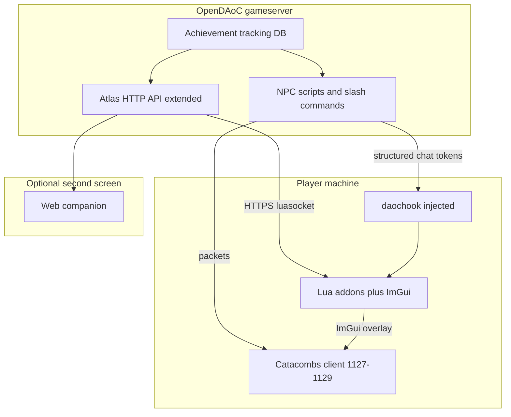

# Player UI enhancements (server, web, and daochook)

**Status:** Design — adopted direction for LS shard QoL.

## Problem

Stock DAoC UI is fixed: merchant windows, inventory grids, and the quest journal cannot be redesigned from OpenDAoC alone. Players on a private shard still benefit from:

- Easier merchants and bag management
- Clearer quest tracking
- A first-class **achievement** system with a real UI

## Three layers (use together)



| Layer | Tool | Best for |
|-------|------|----------|
| **A — Server-only** | OpenDAoC scripts, dialogs, commands | Works for every player; no client install |
| **B — In-game overlay** | [daochook](https://github.com/daochook/daochook) + Lua + ImGui | Achievement panel, bag analyzer, quest tracker **inside** the game window |
| **C — External companion** | Atlas API + browser / second monitor | Account-wide stats, guild tools, patch notes |

**Recommendation:** Build **A on the server first** (fast, universal), then **B for players who opt in** (rich UI), optionally **C** for portal features.

---

## Layer A — Server-only (no client mod)

Works today with zero client changes. Patterns already in core:

| Feature | Implementation |
|---------|----------------|
| Bag summary | `/bags` player command → `SendCustomTextWindow` (free slots, weight, list) |
| Quest summary | `/quests` → text window from active quest state |
| Bulk sell | Custom NPC: whisper menu → `SendCustomDialog` confirm → sell greys/trash |
| Hub merchant | One NPC, keyword menus → multiple `SendMerchantWindow` lists |
| Achievements (text) | DB + `/achievements` text window + chat on unlock |

Limits: no icons, no draggable overlay, no live refresh unless the player re-runs the command.

Reference NPC patterns: `GameServer/scripts/customnpc/BuffMerchantEvent.cs`, `AccountVaultKeeper.cs`.

---

## Layer B — [daochook](https://github.com/daochook/daochook) (client injection)

[daochook](https://github.com/daochook/daochook) is a **third-party client hook** for private-server DAoC. It injects into `game.dll` and exposes:

- **Lua addons** (MoonJIT / LuaJIT) with sandboxed event handlers
- **ImGui** rendered via Direct3D hook — real in-game windows, buttons, tabs, progress bars
- Hooks on **commands**, **chat messages**, **incoming/outgoing packets**, and the **D3D present** loop
- **luasocket / luasec** — HTTPS from addons to your gameserver API
- Per-account `user.dat` fix for multiboxing

Docs: [daochook.github.io](https://daochook.github.io/) · [Features](https://daochook.github.io/features/) · [Developers / events](https://daochook.github.io/developers/events/)

### What addons can do (relevant to LS shard)

| Goal | daochook approach |
|------|-------------------|
| Achievement UI | ImGui window; poll server API or parse `[LS]` chat tokens |
| Inventory helper | Read client memory via FFI + ImGui; or display server `/bags` data |
| Quest tracker | `message` event filter + ImGui sidebar; optional packet inspection |
| Merchant helper | Price list overlay from server JSON; cannot change native merchant grid |
| Custom slash UI | `/lsach`, `/lsbags` handled in `command` event → open ImGui |

Example event registration (from daochook docs):

```lua
hook.events.register('command', 'ls_ach_cb', function (e)
    local args = e.modified_command:args()
    if args[1]:ieq('/lsach') then
        e.blocked = true
        show_achievement_window()
        return
    end
end)
```

ImGui: `require 'imgui'` — see [ImGui namespace docs](https://daochook.github.io/developers/namespaces/imgui/).

### Client version compatibility (critical for LS shard)

| Component | Version |
|-----------|---------|
| LS OpenDAoC PacketLib | **1127–1129** (1130 rejected) |
| Target client | **Catacombs-type** SI + Catacombs + TOA |
| daochook README | **`1.127e [1409]`** only (as of 2026) |

**Action required before mandating daochook:** test your exact Catacombs client binary with daochook’s injector (`daochook.exe <config>.ini`). If injection fails or hooks crash, options are:

1. Pin a client build known to match daochook’s supported `[1409]` build
2. Ask daochook maintainer ([atom0s](https://github.com/atom0s)) on their Discord about 1129 / Catacombs support
3. Integrate daochook launch into [LS-OpenDAoC-Launcher](https://github.com/bedrock1977/LS-OpenDAoC-Launcher) once a supported build is confirmed

daochook is developed against **private servers** (clean-room RE, not live EA servers) — aligned with OpenDAoC use.

### License note

daochook is **GNU AGPL v3**. If you distribute a bundle (launcher + hook + addons), understand AGPL obligations. LS-specific addons in your own repo under MIT/GPL are fine; linking usage docs is enough for optional opt-in.

### Launcher integration (future)

daochook ships `daochook.exe` injector; custom launchers must call its install export. Goal for LS-OpenDAoC-Launcher:

1. Launch Catacombs client
2. Optionally inject daochook
3. Load `addons/ls-shard/` (achievement UI, bag helper)

---

## Layer C — Atlas API companion

Existing: `GameServer/API/ApiHost.cs` (port **5000**, property `atlas_api`).

Today: public read endpoints (`/stats`, `/player/{name}`, guild, relics, news). **No** authenticated live session for inventory/quests.

### Extensions needed for companion / daochook addons

| Endpoint | Purpose |
|----------|---------|
| `POST /auth/session` | Exchange account + password or one-time token for session JWT |
| `GET /me/inventory` | Bag slots, weight (online character only) |
| `GET /me/quests` | Active quests and steps |
| `GET /me/achievements` | Progress and unlocks |
| `GET /shard/achievements` | Static achievement definitions |

Rate-limit and bind tokens to online `GamePlayer` to avoid leaking data.

daochook addons can poll these with **luasocket** without reading game memory.

---

## Achievement system (first on a DAoC private shard)

Split **server truth** from **client display**.

### Server (OpenDAoC)

New DB tables (OpenDAoC-Database patch):

- `achievement` — id, key, name, description, category, points, hidden
- `character_achievement` — char id, achievement id, unlocked_at, progress

Hooks in existing systems:

- `GamePlayerEvent.LevelUp`, kill credit, quest complete, dynamic event complete
- Optional: custom `GamePlayerEvent.AchievementUnlocked` for scripts

On unlock:

1. Persist row
2. `SendMessage` to player (system window)
3. Structured token for daochook (optional):  
   `[LSACH] unlock|first_blood|First Blood|10`

Slash commands:

- `/achievements` — text window (Layer A)
- Server property `achievements_enabled`

### Client (daochook addon — Layer B)

- Parse `[LSACH]` in `message` event **or** poll `/me/achievements`
- ImGui window: categories, progress bars, unlock toast
- `/lsach` toggles panel

### Web (Layer C)

Same API; guild/offline profile pages.

---

## Merchant and inventory QoL (concrete)

### Phase 1 — Server commands (all players)

| Item | Detail |
|------|--------|
| `/bags` | Slots used/free, encumbrance, sorted item list |
| `/quests` | Active quest name, step, hint text |
| Bulk sell NPC | `[Sell greys]` → dialog → sell items below quality threshold |

### Phase 2 — daochook addon (opt-in)

| Item | Detail |
|------|--------|
| Bag overlay | ImGui panel mirroring `/bags` API; refresh on timer |
| Merchant helper | Show server-published buy list / prices beside native window |
| Quest tracker | Pin 1–3 tracked quests from `/me/quests` |

### Phase 3 — Integrated LS launcher package

- Documented optional install
- Preload `ls-shard` addon folder
- Shard rules: opt-in only vs required (recommend **opt-in**)

---

## Quest handling improvements

Server (no daochook):

- Quest board NPC with `[Daily]` / `[Weekly]` keywords
- Clearer `SayTo` popup text on quest NPCs
- `/quests` summary command

daochook addon:

- ImGui tracker with step checklist
- Flash on `message` when quest update text matches patterns

Cannot change the native quest journal layout — supplement it.

---

## Security and fairness

| Concern | Mitigation |
|---------|------------|
| Pay-to-win overlays | Server validates all rewards; UI is display-only |
| Packet sniffing addons | Do not expose secrets in chat tokens; use HTTPS + session tokens |
| Multibox advantage | Same as other UI mods; shard policy decision (allow opt-in) |
| daochook z-buffer / fog toggles | Document as client-side visual only; no server bypass |

---

## Related docs

- [`client-and-deployment.md`](client-and-deployment.md) — client version and PacketLib
- [`../Todo/qol-ui-roadmap.md`](../Todo/qol-ui-roadmap.md) — phased implementation checklist
- [`projectwar-dynamic-events.md`](projectwar-dynamic-events.md) — server events (achievements can hook PQ clears)

## External links

- [daochook GitHub](https://github.com/daochook/daochook)
- [daochook documentation](https://daochook.github.io/)
- [atom0s — daochook announcement](https://atom0s.com/posts/2022/2022-11-01-dark-age-of-camelot/)
